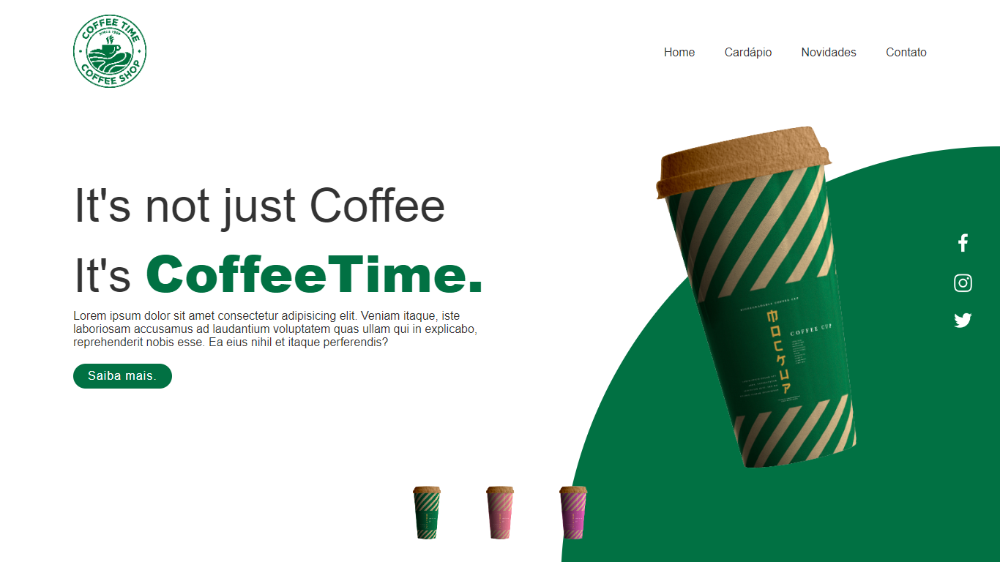

# CoffeeTimeShop

> Desafio HTML clean + CSS.

Projeto construído durante um desafio de codigos html clean + css.

🔗 [Clique aqui para acessar o projeto.](http://kaicbrito.github.io/focus)

## 🛠 Tecnologias usadas;

- HTML
- CSS
- Git e Github.

## Credits
🔗 [Clique aqui para acessar a video aula.](_blank https://youtu.be/91Q6RvKvd7o)

## ✉️ Contato 

kaicbritor@gmail.com
 
